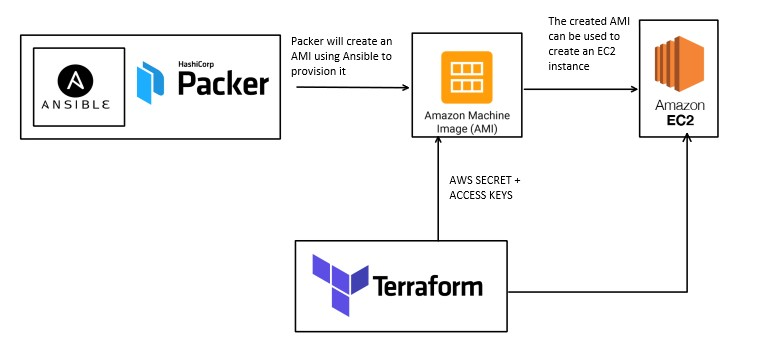

# Terraform and AMI's



<br>

## What is Terraform
- Terraform is a tool for building, changing, and versioning infrastructure safely and efficiently. Terraform can manage existing and popular service providers as well as custom in-house solutions.
- The infrastructure Terraform can manage includes low-level components such as compute instances, storage, and networking, as well as high-level components such as DNS entries, SaaS features, etc.

[Source](https://www.terraform.io/intro/index.html)


<br>

## Why Terraform

- It is agentless so there is no need to install any extra agents apart from Terraform itself
- It is declarative so all you need to do is declare what state you want the infrastructure and Terraform will do the rest for you
- It is cloud-independent, we can use Terraform for AWS, Azure, etc. 

<br>

## Main Commands
- As can be seen when typing `terraform -help`, the main commands are:
    1. `init` - prepares working directory for the other commands
    2. `validate` - checks if the configuration file is valid
    3. `plan` - will show what will change in the infrastructure after applying
    4. `apply` - creates or updates infrastructure
    5. `destroy` - destroys previously-created infrastructure
    6. `refresh` - used to reconcile the state Terraform knows about (via its state file) with the real-world infrastructure

- There are other CLI commands you can use which can be seen using `terraform -help`

<br>

## Examples
- In the following, the AMI's used are already provisioned to run the app and the database (via Packer and Ansible)
- The following examples use variables named within a separate `.tf` file. As the variables contain sensitive information (personal IP's etc.) they were omitted. You will have to use the following structure to create your own file:
    - Create a file named `variables.tf` (it can be named however you want as long as the file extension is `.tf`)
    - Inside this file write the following:
    ```tf
    variable "ami" {
    type = map
    default = {
        "app" = "<ami-id>"
        "db" = "<ami-id>"
        }
    }

    variable "personal" {
        type = map
        default = {
            "key" = "<key-name>"
            "ip" = "<personal-ip>/32"
        }
    }
    ```
- This can also be found in `variables.tf.template`

<br>

### Terraform to create an EC2 instance
- One can create EC2 instances using the resource `aws_instance`
- Documentation can be found [here](https://registry.terraform.io/providers/hashicorp/aws/latest/docs/resources/instance)
- The following creates the app EC2 instance
```
resource "aws_instance" "nodejs_instance" {
    ami = var.ami["app"]
    instance_type = "t2.micro"
    associate_public_ip_address = true
    key_name = var.personal["key"]
    vpc_security_group_ids = [ aws_security_group.appSG.id ]
    tags = {
      "Name" = "eng74-jared-terraform-app"
    }
}
```

<br>

### Terraform to create Security groups
- This can be achieved using the resource `aws_security_group`
- Documentation can be found [here](https://registry.terraform.io/providers/hashicorp/aws/latest/docs/resources/security_group)
- The following creates the security group for the database
```
resource "aws_security_group" "dbSG" {
    name = "eng74.jared.SG.db.terraform"
    description = "allows access to app from port 80 anywhere"

    ingress {
        description = "port 27017 access from app"
        from_port = 27017
        to_port = 27017
        protocol = "tcp"
        cidr_blocks = [ aws_security_group.appSG.id ]
    }

    ingress {
        description = "port 22 from home"
        from_port = 22
        to_port = 22
        protocol = "tcp"
        cidr_blocks = [ var.personal["ip"] ]
    }

    egress {
        description = "outbound with no restrictions"
        from_port   = 0
        to_port     = 0
        protocol    = "-1"
        cidr_blocks = [ "0.0.0.0/0" ]
    }
}
```

<br>

### A more dynamic Terraform
- While we can write key-value pairs explicitly, it is always good to provide more dynamic elements
- We can make use of a separate file containing several variables we can call in our Terraform `main.tf`
    - Variables are used via the keyword `var.<name-of-variable>`
    - `var.<name-of-variable>["<key-name"]` can be used if the variable is a mapping

```
variable "ami" {
    type = map
    default = {
        "app" = "ami-08684e199bfc3817a"
        "db" = "ami-0c01cb6c44345cc41"
    }
}
```

<br>

- One can also use the outputs from previous tasks
- For instance, `main.tf` will create two security groups first. We can then use these newly created security groups as the groups for the EC2 instances that will be created -- all within the same command. How?
    - For any resource, we can call it's variables via `<resource-name>.<identifier>.<variable>`
- Why do it this way?
    - This will save a lot of time as one will no longer need to manually add a security group in AWS


- Example:
    1. The first resource called `appSG` creates the security group for our app instance
    2. Of course since this is a newly-created SG we won't have it's ID to input into the `.tf` file
    3. We can still associate this SG with our app by using the output of it's resource
    4. One can see that in the second resource, the security group being associated to the app is `aws_security_group.appSG.id`, which references the ID of the security group that the first resource creates

```tf
resource "aws_security_group" "appSG" {
    name = "eng74.jared.SG.app.terraform"
    description = "the security group for the app via terraform"

    ingress {
        description = "port 80 access anywhere"
        from_port = 80
        to_port = 80
        protocol = "tcp"
        cidr_blocks = ["0.0.0.0/0"]
    }

    ingress {
        description = "port 22 from home"
        from_port = 22
        to_port = 22
        protocol = "tcp"
        cidr_blocks = [ var.personal["ip"] ]
    }

    egress {
        description = "outbound with no restrictions"
        from_port   = 0
        to_port     = 0
        protocol    = "-1"
        cidr_blocks = ["0.0.0.0/0"]
    }
}

resource "aws_instance" "nodejs_instance" {
    ami = var.ami["app"]
    instance_type = "t2.micro"
    associate_public_ip_address = true
    key_name = var.personal["key"]
    vpc_security_group_ids = [ aws_security_group.appSG.id ]
    tags = {
      "Name" = "eng74-jared-terraform-app"
    }
}
```

<br>

### Connecting the database and app instances within Terraform
- AWS has a built-in provisioner that runs whenever an instance is created, we can use it to connect the database and app
- Once the database instance is created, we can reference it's private ip and use it to connect the two
- The code is written below:
```tf
resource "aws_instance" "nodejs_instance" {
    ami = var.ami["app"]
    instance_type = "t2.micro"
    associate_public_ip_address = true
    key_name = var.personal["key"]
    vpc_security_group_ids = [ aws_security_group.appSG.id ]
    user_data = <<-EOF
        #!/bin/bash
        echo "export DB_HOST=${aws_instance.mongodb_instance.private_ip}" >> /home/ubuntu/.bashrc
        export DB_HOST=${aws_instance.mongodb_instance.private_ip}
        source /home/ubuntu/.bashrc
        cd /home/ubuntu/app
        pm2 start app.js --update-env
        pm2 restart app.js --update-env
        EOF
    tags = {
      "Name" = "eng74-jared-terraform-app"
    }
}
```

<br>

### VPCs, subnets and more infrastructure
- We now want to create our own VPC alongside a private and public subnet. We also want to create the necessary infrastructure (route tables, network ACLs etc.)

- The code is split up among several files in `terraform-files`. The resources used were:
    - `aws_vpc`
    - `aws_subnet`
    - `aws_internet_gateway`
    - `aws_route_table` and `aws_route_table_association`
    - `aws_network_acl`

<br>

### What's next?

- Create a Bastion server so the database is more secure

<br>

---
**Used:**

1. [Variables in Terraform](https://upcloud.com/community/tutorials/terraform-variables/)