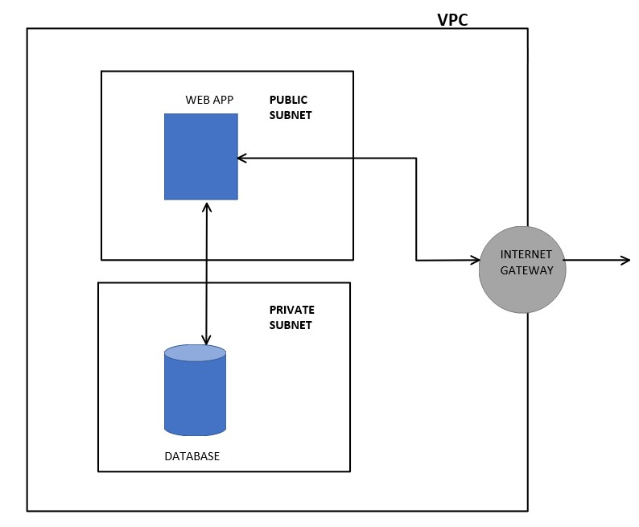

## This folder contains previous iterations of the code
## `main.tf` is the 1st iteration
- Just an app and database running in the default VPC
- Safety is handled at the security group level for the database

 

## `terraform-files` is the 2nd iteration
- An app and database running in separate subnets within a newly-created VPC
- Safety is handled at the VPC, subnet(NACLs) and security group level for the database
- Structure at this stage is:
    

 

## `main-iteration-three.tf`is the third iteration 
- This is the previous iteration but modularised. It therefore has the same structure.
- This makes use of the `app`, `db` and `vpc-etc` modules found in `modules`
